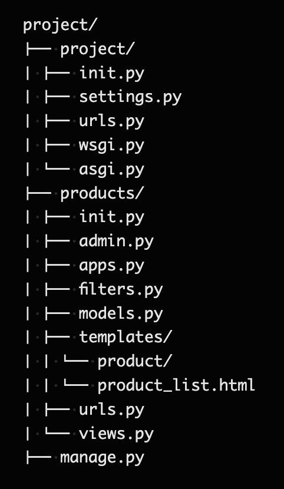
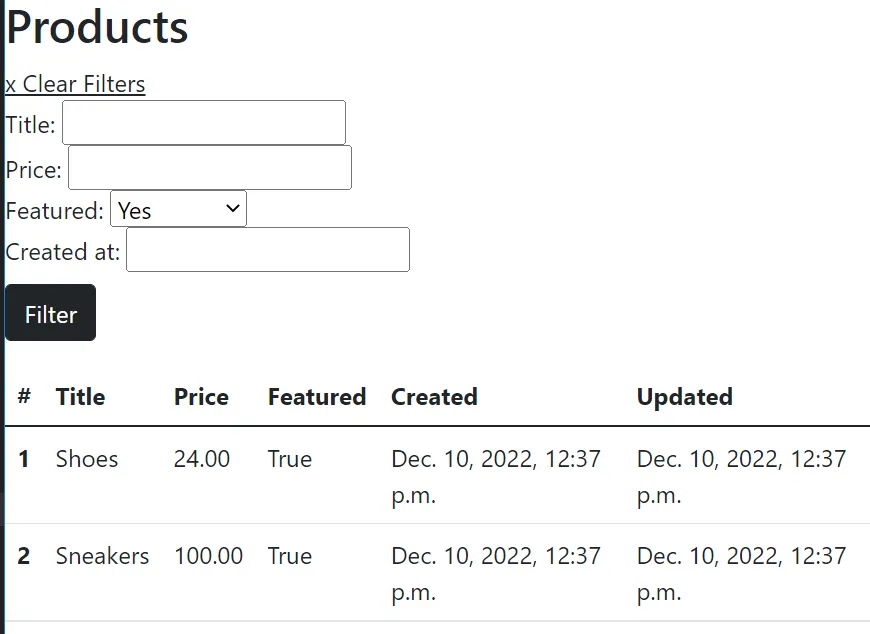

# Django Product List with Filters

This project demonstrates how to create a product list with filtering functionality using Django and django-filter.

## Prerequisites

- Python 3.12

## Installation

1. Clone the repository:
    ```bash
    git clone https://github.com/sachnaror/django-product-filter.git
    cd django-product-filter
    ```

2. Create and activate a virtual environment:
    ```bash
    python -m venv venv
    source venv/bin/activate  # On Windows use `venv\Scripts\activate`
    ```

3. Install the required packages:
    ```bash
    pip install -r requirements.txt
    ```

4. Apply migrations and create a superuser:
    ```bash
    python manage.py makemigrations
    python manage.py migrate
    python manage.py createsuperuser
    ```

5. Run the development server:
    ```bash
    python manage.py runserver
    ```

## Project Structure






